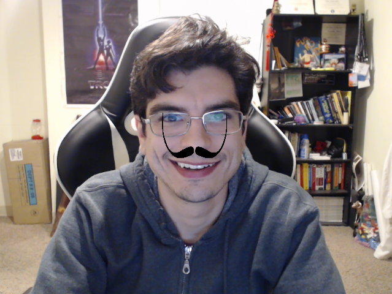

# Feature tracking and image overlay demo



The surrealist artist [Salvador Dali](https://en.wikipedia.org/wiki/Salvador_Dal%C3%AD) is easily identifiable by his flamboyant mustache.  This demonstration of [Haar Cascade](https://en.wikipedia.org/wiki/Haar-like_feature) feature detection and [OpenCV](https://opencv-python-tutroals.readthedocs.io/en/latest/py_tutorials/py_tutorials.html)'s image processing tools takes a webcam stream and superimposes Dali's mustache under every detected nose.


## Dependencies

  * [OpenCV](https://opencv-python-tutroals.readthedocs.io/en/latest/py_tutorials/py_tutorials.html)
  * [numpy](http://www.numpy.org/)

You can use [pip](https://pypi.python.org/pypi/pip) to install any missing dependencies.

## Basic Usage

This code takes takes the feed of the first available webcam connected to a system and superimposes Salvador Dali's mustache below any noses that are detected.  The script is executed by running:

```
python dali-demo.py
```

This code can easily be modified to work with any other classifier or overlay image.
